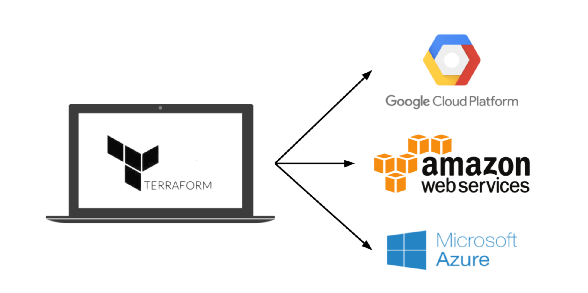

# 第1章 为何选择Terraform

代码在您的计算机上运行的代时候，代码刚刚测试通过的时候，当有人让您去部署代码的时候，这些情况下都意味着软件并未交付。 只有当您将软件交付给用户的时候，软件才算正式发布。 软件交付包括您为客户提供代码交付所需的所有工作，例如在生产服务器上运行该代码，使代码能够适应中断和流量峰值，以及保护代码免受攻击者攻击。 在深入了解Terraform的细节之前，有必要回顾下Terraform在哪些方面适合软件交付。 

在本章中，我将深入研究以下主题： 

•DevOps的崛起

 •基础设施即代码

 •基础设施即代码的好处

 •Terraform如何运作

 •Terraform与其他基础设施即代码工具的比较

## DevOps的崛起 

在不远的过去，如果你想建立一家软件公司，那你将不得不管理很多硬件。您可以设置机柜和机架，使用服务器加载它们，连接接线，安装冷却，构建冗余电源系统等等。你需要有一个团队，通常称为“运维团队“，致力于管理这些硬件，以及一个独立的团队，通常称为“开发团队“，专门用于编写软件。 

典型的开发团队执行应用程序构建，并将构建完的程序移交给运维团队。然后由运维团队决定如何部署和运行该应用程序。大多数情况下，这一环节是手动完成的。在某种程度上，这是不可避免的，因为大部分工作都与物理连接硬件（例如货架服务器，连接网络电缆）有关。但即使运维团队所做的工作，例如安装应用程序及其依赖项，通常也是通过在服务器上手动执行命令来完成的。 

这种情况短期内很有效，但随着公司的发展，你最终会遇到问题。由于发布是手动完成的，随着服务器数量的增加，发布变得缓慢，痛苦和不可预测。 运维团队偶尔会出错，所以你最终会得到“雪花服务器“，即其中一台服务器的配置与其他服务器配置不同，结果导致出错的情况增加。开发人员可能会说：“它可以在我的机器上运行！”，但是，停机频次和停机时间可能会大幅增加。 

运维团队在每次发布后的凌晨3点都对他们的寻呼机感到厌倦，将发布节奏减少到每周一次。然后每个月一次。然后每六个月一次。在两年一次的发布前几周，团队开始尝试将所有项目合并在一起，导致合并冲突的混乱。没人能稳定发布分支。团队之间开始互相指责，该公司陷入停顿。

如今，这一现象已经明显改观。许多公司不再管理自己的数据中心，而是转向云计算，利用Amazon Web Services（AWS），Azure和Google Cloud等服务。许多运维团队不是大量投资硬件，而是使用Chef，Puppet，Terraform和Docker等工具将所有时间花在软件上。许多系统管理员不是编写服务器和插入网络电缆，而是编写代码。 

因此，开发和运维团队都将大部分时间花在软件上，两个团队之间的区别正在变得模糊。虽然让一个独立的开发团队负责应用程序代码，而让运维团队负责代码交付可能依然可行，但很明显开发和运维需要更紧密地协同工作。这便是DevOps一词的来源。 

DevOps不是团队、职称或特定技术的名称。相反，它是一组流程，想法和技术。每个人对DevOps的定义都略有不同，但对于本书，我将使用以下内容： 

####          DevOps的目标是使软件交付更加高效。 

您可以持续集成代码并始终将其保持在可部署状态，而无需再经历历时好几天的代码合并。您可以每天部署代码数十次，甚至可以在每次提交后部署代码，而不是每月部署一次代码。您可以通过构建弹性，自我修复系统，并使用监控和警报来捕获无法自动解决的问题，从而避免出现持续故障和停机的状况。 

采用DevOps实践的公司所需要的成果是令人震惊。例如，Nordstrom发现，在将DevOps实践应用于他们的组织后，他们能够将每月交付的功能数量增加一倍，将缺陷减少50％，缩短交付周期（从产生想法到在生产环境运行代码）减少60％，并将生产环境故障数量减少60％～90％。在HP的LaserJet固件部门开始采用DevOps实践之后，开发人员开发新功能所花费的时间从5％增加到40％，总体开发成本降低了40％。 Etsy使用DevOps实践之后，一改原本部署压力大，频次低，故障率高的情况，实现了每天25～50次的持续部署。

DevOps有四个核心价值观：文化，自动化，测量和共享（可以缩写为CAMS）。本书并不是对DevOps的全面概述，因此我将只关注其中一个值：自动化。 自动化的目标是尽可能多地自动化交付软件。这意味着您是通过代码，而不是通过单击网页或手动执行shell命令来管理您的基础设施，这就是通常所说的基础设施即代码的含义。

### 什么是基础设施即代码

基础设施即代码（IAC）背后的想法是您可以通过编写和执行代码的方式， 定义、部署和更新您的基础架构。 这是一个重要的思维方式的转变，您把所有的操作都视为软件，即使是对硬件进行操作（例如设置物理服务器）。 事实上，DevOps的一个重要功能，是您可以管理代码中的几乎所有内容，包括服务器，数据库， 网络，日志文件，应用程序配置，文档，自动化测试， 部署过程等。 

IAC工具有四大类： 

•临时脚本 

•配置管理工具 

•服务器模板工具

•编排工具

下面我们一次来看下这几大类。

#### 临时脚本

自动化任何工作最直接的方法是写一个临时的脚本。 您可以手动执行任务，将其分解为离散的任务步骤，通过使用您最喜欢的脚本语言（例如Bash，Ruby，Python）来定义代码中的每一个步骤，并在服务器上执行该脚本，如图1-1所示。 

图1-1. 在服务器上运行临时脚本 

例如，有一个名为setup-webserver.sh的Bash脚本，它依次执行安装依赖项，从Git仓库拷贝代码，启动Apache Web服务器，并完成服务器的配置。

```text
＃更新apt-get缓存 
  sudo apt-get update
＃安装PHP 
  sudo apt-get install -y php
＃安装Apache
  sudo apt-get install -y apache2
# Copy the code from repository
  sudo git clone https://github.com/brikis98/php-app.git /var/www/html/app
# 启动Apache
  sudo service apache2 start
```

临时脚本的好处是你可以使用通用编程语言，您可以根据需要编写代码。但这也可能会带来很多问题。

而为IAC专门构建的工具则提供了简洁的API来完成复杂的任务，如果你使用的是通用编程语言，你可以为每个任务编写完全自定义的代码。此外，为IAC设计的工具，通常可以为您的代码强制执行特定的结构，而具有通用性的编程语言，则可以使每个开发人员都使用自己的风格来做一些不同的事情。如果仅仅只是运行八行代码来安装Apache脚本来说，这些问题都不是很重要，但如果您尝试使用临时脚本来管理数百台服务器，数据库，负载均衡器，网络配置等，那就很容易出现混乱。 

如果你曾经不得不维护别人的临时脚本仓库，你就会知道，维护成本有多高。临时脚本非常适合运行小规模的一次性任务，但是如果您要管理所有的基础设施即代码脚本，那么你应该使用专为此设计的IAC工具。 

#### 配置管理工具 

Chef，Puppet，Ansible和SaltStack都是配置管理工具，它们的主要功能是安装和管理现有服务器上的软件。例如，下面是一个Ansible Role脚本，它的配置与上一节Apache Web服务器的配置相同 ：

```text
- name: Update the apt-get cache
 apt:
  update_cache: yes
- name: Install PHP
  apt:
  name: php
- name: Install Apache
  apt:
  name: apache2
- name: Copy the code from repository
  git: repo=https://github.com/brikis98/php-app.git dest=/var/www/html/app
- name: Start Apache 
  service: name=apache2 state=started enabled=yes
```

 上面这段代码类似于bash脚本，区别仅仅是Ansible将对文档和明确的命名参数，执行一致性和结构校验。 看下Ansible如何支持内置任务，例如使用安装包，使用git apt和check out命令。 虽然这段Ansible Role代码和Bash 脚本大小差不多，但是当您开始使用Ansible执行更高级的命令时，这种差异将会变得更加明显。 

而且，和临时脚本不同，后者是为在本地服务器上运行设计的，而Ansible和其他配置管理工具，则是专门设计用于管理大量远程服务器的，如图1-2所示。

例如，要将上面的Web服务器角色应用于5个服务器，首先要创建一个host文件，里面包含需要管理的远程服务器IP地址：

```text
[Web服务器] 
  11.11.11.11 
  11.11.11.12 
  11.11.11.13 
  11.11.11.14 
  11.11.11.15 
```

接下来，您就可以定义Ansible Playbook：

```text
hosts: webservers
roles:
  - webserver
```

接着，按如下方式执行playbook：

`ansible-playbook playbook.yml` 

#### 服务器模板工具

配置管理的替代方案越来越受欢迎 最近是服务器模板工具，如Docker，Packer和Vagrant。代替 启动一堆服务器并通过运行相同的代码来配置它们 每一个，服务器模板工具背后的想法是创建一个服务器的图像 捕获操作系统，软件，完全独立的“快照” 文件和所有其他相关细节。您可以为每个图像指定唯一的版本号， 将映像部署到任何环境，并回滚到以前的版本（如果有的话） 出错。当然，要在所有服务器上部署映像，您仍然需要一些 其他IAC工具。例如，您可以使用Terraform，如下一节所示， 或者您可以使用Ansible，如图1-3所示。

如图1-4所示，两大类常用的处理镜像的工具： 

#### 虚拟机（VM） 

虚拟机（VM）模拟整个计算机系统，包括硬件。 您运行虚拟机管理程序（如VMWare，VirtualBox或Parallels）来虚拟化底层CPU，内存，硬盘和网络。任何在虚拟机管理程序上运行的VM映像只能看到虚拟化硬件， 它与主机和任何其他VM映像之间是完全隔离的，并且在所有环境中都以完全相同的方式运行（例如您的计算机，QA 服务器，生产服务器等）。虚拟机的缺点是所有这些虚拟化程序，在CPU使用率，内存使用率和启动时间方面会产生大量开销。 您可以使用Packer和Vagrant等工具将VM映像定义为代码。 

#### 容器（Container）

容器模拟操作系统的用户空间。你运行一个容器引擎，如Docker或CoreOS rkt，来创建孤立的进程、内存、挂载点和网络。您运行的任何容器（如Docker容器） 在容器引擎之上只能看到自己孤立的用户空间，所以它不能看到主机或其他容器，并且它将以完全相同的方式，在所有环境中运行（例如您的计算机，QA服务器，生产服务器等）。 由于容器直接在主机上运行，​​因此隔离不是像VM一样安全，但几乎它没有CPU或内存开销，并且容器可以在几毫秒内启动。 您可以使用Docker和CoreOs rkt等工具，将容器镜像定义为代码。

1图1-4。 两种主要的镜像类型：左侧是虚拟机，右侧是容器。 虚拟机虚拟化硬件，而容器仅虚拟化用户空间。

例如，这是一个创建AWS机器映像的Packer模板 （AMI），它可以在Amazon Web Services（AWS）上运行的VM映像：

```text
{
    "builders": [{
    "ami_name": "packer-example",
    "instance_type": "t2.micro",
    "region": "us-east-1",
    "type": "amazon-ebs",
    "source_ami": "ami-40d28157",
    "ssh_username": "ubuntu"
  }],
    "provisioners": [{
    "type": "shell",
    "inline": [
    "sudo apt-get update",
    "sudo apt-get install -y php",
    "sudo apt-get install -y apache2",
    "sudo git clone https://github.com/brikis98/php-app.git /var/www/html/app"
        ]
      }]
    }
```

此Packer模板配置和您之前看到的Apache Web服务器配置相同，唯一的区别：这个Packer模板将不启动Apache Web服务器（如通过调用sudo service apache2 start）。

#### 编排工具

配置管理和服务器模板工具主要用于在每个服务器上运行的代码，而Terraform，CloudFormation和OpenStack Heat等编排工具则用于自行创建服务器，这一过程称为编排或配置。 实际上，您可以使用编排工具来配置服务器，操作数据库，缓存，负载均衡器，队列，监控，配置子网，配置防火墙，配置路由规则，SSL证书以及基础架构的几乎所有其他方面， 如图1-5所示。

例如，以下是部署Web服务器，数据库和负载均衡器的Terraform代码：

```text
resource "aws_instance" "app" {
  instance_type = "t2.micro"
  availability_zone = "us-east-1a"
  ami = "ami-40d28157"
  
  user_data = <<-EOF
        #!/bin/bash
        sudo service apache2 start
        EOF
  }
  
 resource "aws_db_instance" "db" {
   allocated_storage = 10
   engine = "mysql"
   instance_class = "db.t2.micro"
   name = "mydb"
   username = "admin"
   password = "password"
  }   
  
 resource "aws_elb" "load_balancer" { 
    name = "frontend-load-balancer"
    instances = ["${aws_instance.app.id}"]
    availability_zones = ["us-east-1a"]  

    listener {
    instance_port = 8000 instance_protocol = "http" lb_port = 80
    lb_protocol = "http"
  } 
}

```

}

如果您还不熟悉某些语法，请不要担心。现在，只关注资源“aws\_instance”部分，即Web服务器，并注意两个参数： AMI 此参数指定要在服务器上部署的AMI的ID。您可以将其设置为上一节中使用Packer模板构建的AMI的ID，该模板具有PHP，Apache和应用程序源代码。 用户数据 这是一个在Web服务器启动时执行的bash脚本。上面的示例使用此脚本启动Apache。 换句话说，上面的代码显示了编排和服务器模板一起工作，这是不可变基础结构中的常见模式。 

### 使用基础设施即代码的好处 

现在你已经看到了所有不同类型的基础设施作为代码，一个很好的问题是，为什么要这么麻烦？为什么要学习一堆新的语言和工具，并用更多代码来管理自己？ 答案是代码功能强大。作为将手动操作转换为代码的前期投资的交换，您可以显着提高您交付软件的能力。根据2016年DevOps报告状态，使用DevOps实践的组织（如IAC）的部署速度提高了200倍，故障恢复速度提高了24倍，交付时间缩短了2,555倍。 将基础结构定义为代码时，您可以使用各种软件工程实践来显着改善软件交付过程，包括：

自助服务 大多数手动部署代码的团队都拥有少量的系统管理员（通常只有一个），他们是唯一知道使部署工作的所有神奇咒语的人，并且是唯一可以访问生产的人。随着公司的发展，这成为一个主要的瓶颈。如果您的基础架构是在代码中定义的，那么整个部署过程可以自动化，开发人员可以在必要时启动自己的部署。 速度和安全 如果部署过程是自动化的，那么速度会快得多，因为计算机可以比人快得多地执行部署步骤，并且更安全，因为自动化过程将更加一致，更可重复，并且不容易手动错误。 文档 您可以在任何人都可以阅读的源文件中表示基础架构的状态，而不是将您的基础架构状态锁定在单个系统管理器的头部。换句话说，IAC充当文档，允许组织中的每个人理解事物的工作方式，即使系统管理员去度假也是如此。 版本控制 您可以将IAC源文件存储在版本控制中，这意味着现在可以在提交日志中捕获基础架构的整个历史记录。这成为调试问题的强大工具，因为每当弹出问题时，您的第一步将是检查提交日志并找出基础设施中发生的变化，第二步可能是通过简单地解决问题恢复到以前的，已知良好的IAC代码版本。 验证 如果基础架构的状态是在代码中定义的，那么对于每一次更改，您都可以执行代码审查，运行一系列自动化测试，并通过静态分析工具传递代码，所有已知的实践都可以显着降低机会缺陷 重用 您可以将基础架构打包成可重复使用的模块，这样您就可以在每个环境中从头开始为每个产品进行每次部署，而不是在已知的，经过记录的，经过实战检验的部件之上构建。


#### 幸福 

为什么你应该使用IAC还有另一个非常重要且经常被忽视的原因：它让开发人员感到高兴。手动部署代码和管理基础架构是重复且乏味的。开发人员对这类工作表示不满，因为它不涉及创造力，没有挑战，也没有认可。您可以完美地部署代码数月，没有人会注意到 - 直到有一天你搞砸了。这造成了一种压力和不愉快的环境。 IAC提供了一个更好的替代方案，允许计算机做他们最擅长的事情（自动化）和开发人员做他们最擅长的事情（编码）。 既然您已经了解了IAC为何如此重要，那么接下来的问题是Terform是否是适合您的IAC工具。为了回答这个问题，我首先要对Terraform的工作方式做一个非常快速的入门，然后我将它与其他流行的IAC选项进行比较，比如Chef，Puppet和Ansible。 

### Terraform如何运作 

Terraform是一个用Go编程语言编写的开源工具。 Go代码编译成单个二进制文件（或者更确切地说，是每个支持的操作系统的一个二进制文件），毫不奇怪，它被称为terraform。 您可以使用此二进制文件从笔记本电脑或构建服务器或几乎任何其他计算机部署基础结构，并且您无需运行任何额外的基础结构来实现此目的。这是因为在幕后，所有terraform二进制文件都代表您向一个或多个提供商进行API调用，例如Amazon Web服务（AWS），Azure，Google Cloud，DigitalOcean等。这意味着Terraform可以利用这些提供商已经为其API服务器运行的基础架构，以及您已经与这些提供商一起使用的身份验证机制（例如，您已经为AWS提供的API密钥）。 Terraform如何知道要调用的API调用？答案是您编写Terform模板，这些模板是指定您希望创建的基础结构的文本文件。这些模板是“基础架构中的代码”中的“代码”。这是一个示例模板：

```text
resource "aws_instance" "example" { 
  ami = "ami-40d28157" 
  instance_type = "t2.micro"
}

resource "dnsimple_record" "example" { 
  domain = "example.com"
  name = "test"
  value = "${aws_instance.example.public_ip}" type = "A"
}
```

即使您以前从未见过Terraform代码，也不应该过多地阅读它。 上面的代码片段告诉Terraform对AWS进行API调用以部署服务器，然后对DNSSimple进行API调用以创建指向该服务器IP地址的DNS条目。 只需一个简单的语法（您将在第2章中学习），Terraform允许您跨多个云提供商部署互连资源。 您可以定义整个基础架构服务器，数据库，负载平衡器，网络拓扑等内置Terraform模板，并将这些模板提交到版本控制。 然后，您可以运行某些Terraform命令（例如terraform apply）来部署该基础结构。 terraform二进制文件解析您的代码，将其转换为对代码中指定的云提供程序的一系列API调用，并代表您尽可能高效地进行这些API调用，如图1-6所示。



当您团队中的某个人需要对基础架构进行更改，而不是手动更新基础架构时，他们会在Terraform模板中进行更改，通过自动化测试和代码审查验证这些更改，将更新的代码提交到版本控制，以及 然后运行terraform apply命令让Terraform进行必要的API调用以部署更改。

### Terraform与其他基础设施即代码工具的比较

 作为代码的基础设施（IAC）很棒，但选择IAC工具的过程却不是。许多IAC工具与它们的工作重叠。其中许多都是开源的。其中许多提供商业支持。除非你自己使用过每一个，否则你应该用什么标准来挑选一个或另一个。 更难以理解的是，您在这些工具之间找到的大多数比较只是列出每个工具的一般属性，并使其听起来像您可以同样成功地使用它们。虽然这在技术上是正确的，但它没有帮助。这有点像告诉一个编程新手，你可以同样成功地用PHP，C或汇编建立一个网站 - 一个技术上真实的陈述，但是省略了大量的信息，这对于做出一个好的决定是必不可少的。 在接下来的部分中，我将对最流行的配置管理和编排工具进行详细比较：Terraform，Chef，Pup pet，Ansible，SaltStack，CloudFormation和OpenStack Heat。我的目标是通过解释为什么我的公司Gruntwork选择Terraform作为我们选择的IAC工具，从某种意义上说，为什么我写这本书，帮助你决定Terraform是否是一个不错的选择.5与所有技术决策一样，它是权衡和优先级的问题，虽然您的特定优先级可能与我的不同，但我希望分享这个思考过程将帮助您做出自己的决定。 以下是需要考虑的主要权衡因素： •配置管理与编排 •可变基础架构与不可变基础架构 •程序语言与声明语言 •客户端/服务器架构与仅客户端架构 •大型社区与小型社区 •成熟与前沿 配置管理与编排 如前所述，Chef，Puppet，Ansible和SaltStack都是配置管理工具，而CloudFormation，Terraform和OpenStack Heat都是编排工具。

虽然区别并不完全清楚，因为配置管理工具通常可以进行某种程度的编排（例如，您可以使用Ansible部署服务器），编排工具通常可以进行一定程度的配置（例如，您可以运行配置脚本）您使用Terform配置的每个服务器），您通常希望选择最适合您的用例的工具。 

特别是，如果您使用服务器模板工具（如Docker或Packer），则绝大多数配置管理需求已经得到了解决。从Dockerfile或Packer模板创建映像后，剩下要做的就是为运行这些映像配置基础结构。当涉及到提供时，编排工具将是您的最佳选择。 也就是说，如果您不使用服务器模板工具，一个很好的选择是一起使用配置管理和编排工具。例如，您可以使用Terraform配置服务器并运行Chef来配置每个服务器。 可变基础设施与不可变基础设施 Chef，Puppet，Ansible和SaltStack等配置管理工具通常默认为可变的基础架构范例。例如，如果您告诉Chef安装新版本的OpenSSL，它将在现有服务器上运行软件更新，并且更改将在原地进行。随着时间的推移，当您应用越来越多的更新时，每个服务器都会建立一个独特的更改历史记录。结果，每个服务器与所有其他服务器略有不同，导致难以诊断和重现的细微配置错误（这是当您手动管理服务器时发生的相同配置漂移问题，尽管它的问题要小得多 - 使用配置管理工具时的lematic。 如果您使用Terraform等编排工具来部署由Docker或Packer创建的机器映像，那么大多数“更改”实际上是新服务器的部署。例如，要部署新版本的OpenSSL，您可以使用已安装新版本OpenSSL的Packer创建新映像，将该映像部署到一组新服务器上，然后取消部署旧服务器。这种方法降低了配置偏移错误的可能性，使您更容易确切知道每台服务器上运行的软件，并允许您随时轻松部署任何以前版本的软件（任何以前的图像）。 当然，也可以强制配置管理工具进行不可变部署，但这不是这些工具的惯用方法，而是使用编排工具的一种自然方式。值得一提的是，不可变方法本身也有缺点。例如，从服务器模板重建映像并重新部署所有服务器以进行微不足道的更改可能需要很长时间。此外，不变性只会持续到你实际运行图像为止。一旦服务器启动并运行，它将开始在硬盘驱动器上进行更改并遇到一定程度的配置偏差（尽管如果经常部署，这可以减轻）。

#### 程序语言与声明语言

Chef和Ansible鼓励一种程序风格，您可以编写代码，逐步指定如何实现某些所需的最终状态。 Terraform，CloudFormation，SaltStack，Puppet和Open Stack Heat都鼓励更具说明性的风格，您可以在其中编写指定所需最终状态的代码，IAC工具本身负责确定如何实现该状态。 为了证明这种差异，我们来看一个例子。 想象一下，您希望部署10台服务器（AWS术语中的“EC2 Instances”）来运行ID为ami-40d28157（Ubuntu 16.04）的AMI。 以下是使用过程方法执行此操作的Ansible模板的简化示例：

```text
- ec2:
        count: 10
        image: ami-40d28157
        instance_type: t2.micro
```

以下是使用声明方法执行相同操作的Terraform模板的简化示例：

```text
  resource "aws_instance" "example" { 
      count = 10
      ami = "ami-40d28157" 
      instance_type = "t2.micro"
  }

```

现在在表面上，这两种方法可能看起来相似，当您最初使用Ansible或Terraform执行它们时，它们将产生类似的结果。 有趣的事情就是当你想要做出改变时会发生什么。 例如，假设流量已经增加，并且您希望将服务器数量增加到15.使用Ansible，您之前编写的过程代码不再有用; 如果您刚刚将服务器数量更新为15并重新启动该代码，那么它将部署15台新服务器，总共提供25台服务器！ 因此，您必须了解已部署的内容并编写一个全新的过程脚本来添加5个新服务器：

```text
- ec2:
        count: 5
        image: ami-40d28157
        instance_type: t2.micro
```

如果你执行了这个模板，Terraform会意识到它已经创建了10个服务器，因此它需要做的只是创建5个新服务器。 实际上，在运行此模板之前，您可以使用Terraform的计划命令来预览它将进行的更改：

```text
> terraform plan
    + aws_instance.example.11
        ami:                      "ami-40d28157"
        instance_type:            "t2.micro"
    + aws_instance.example.12
        ami:                      "ami-40d28157"
        instance_type:            "ami-40d28157"
    + aws_instance.example.13
        ami:                      "ami-40d28157"
        instance_type:            "t2.micro"
    + aws_instance.example.14
        ami:                      "ami-40d28157"
        instance_type:            "t2.micro"
    + aws_instance.example.15
        ami:                      "ami-40d28157"
        instance_type:            "t2.micro"
    Plan: 5 to add, 0 to change, 0 to destroy.
```

现在，当您想要部署不同版本的应用程序时会发生什么，例如AMI ID ami-408c7f28？ 使用过程方法，您之前的两个Ansible模板都没有用，所以您必须编写另一个模板来跟踪之前部署的10个服务器（或者现在是15个？）并仔细更新每个模板到新版本。 使用Terraform的声明式方法，您可以再次返回完全相同的模板，只需将ami参数更改为ami-408c7f28：

```text
resource "aws_instance" "example" { 
    count = 15
    ami = "ami-408c7f28" 
    instance_type = "t2.micro"
}
```

显然，上述例子是简化的。 Ansible允许您在部署新的EC2实例之前使用标签来搜索现有的EC2实例（例如，使用instance\_tags和count\_tag参数），但是必须根据每个资源的情况为Ansible管理的每个资源手动找出这种逻辑。 过去的历史，可能会令人惊讶地复杂化（例如，不仅通过标签，还可以通过图像版本，可用区域等查找现有实例）。 这突出了程序IAC工具的两个主要问题：

1.程序代码不能完全捕获基础架构的状态。阅读上面的三个Ansible模板并不足以了解已部署的内容。您还必须知道这些模板的应用顺序。如果您以不同的顺序应用它们，您可能最终得到了不同的基础结构，而这不是您在代码库本身中可以看到的。换句话说，要推理Ansible或Chef代码库，您必须知道所发生的每个更改的完整历史记录。 

2.程序代码限制了可重用性。过程代码的可重用性是有限的，因为您必须手动考虑代码库的当前状态。由于该状态不断变化，您一周前使用的代码可能不再可用，因为它旨在修改不再存在的基础架构状态。结果，程序代码库随着时间的推移趋于变大和变得复杂。 

使用Terraform的声明式方法，代码始终代表基础架构的最新状态。一目了然，您可以分辨当前部署的内容及其配置方式，而无需担心历史记录或时间安排。这也使得创建可重用代码变得容易，因为您不必手动考虑当前的世界状态。相反，你只关注描述你想要的状态，而Terraform会自动解决如何从一个状态到另一个状态的问题。因此，Terraform代码库往往保持小巧且易于理解。 

当然，声明性语言也有缺点。如果无法使用完整的编程语言，您的表达能力就会受到限制。例如，某些类型的基础架构更改（例如零停机时间部署）难以用纯粹的声明性术语表达（但并非不可能，正如您将在第5章中看到的那样）。同样，如果没有“逻辑”（例如if语句，循环）的能力，创建通用的，可重用的代码可能会很棘手。幸运的是，Terraform提供了许多强大的原语 - 例如输入变量，输出变量，模块，create\_before\_destroy，count和插值函数 - 这使得即使在声明性语言中也可以创建干净，可配置的模块化代码。我将在第4章和第5章回到这些主题。 

#### 客户端/服务器架构与仅客户端架构 

Chef，Puppet，SaltStack，CloudFormation和Heat都默认使用客户端/服务器架构，如图1-7所示。客户端可以是Web UI或CLI工具，用于发出命令（例如“部署X”）。这些命令转到服务器，服务器负责执行命令并存储系统状态。要执行这些命令，服务器会与代理进行通信，代理必须在要配置的每个服务器上运行。

![&#x56FE;1.7 Chef&#xFF0C;Puppet&#xFF0C;SaltStack&#xFF0C;CloudFormation&#x548C;Heat&#x90FD;&#x4F7F;&#x7528;&#x5BA2;&#x6237;&#x7AEF;/&#x670D;&#x52A1;&#x5668;&#x67B6;&#x6784;&#x3002; &#x4E0A;&#x56FE;&#x663E;&#x793A;&#x4E86;&#x5728;&#x60A8;&#x7684;&#x8BA1;&#x7B97;&#x673A;&#x4E0A;&#x8FD0;&#x884C;&#x7684;Chef&#x5BA2;&#x6237;&#x7AEF;&#xFF0C;&#x8BE5;&#x5BA2;&#x6237;&#x7AEF;&#x4E0E;Chef&#x670D;&#x52A1;&#x5668;&#x901A;&#x4FE1;&#xFF0C;&#x8BE5;&#x670D;&#x52A1;&#x5668;&#x901A;&#x8FC7;&#x4E0E;&#x5728;&#x6240;&#x6709;&#x5176;&#x4ED6;&#x670D;&#x52A1;&#x5668;&#x4E0A;&#x8FD0;&#x884C;&#x7684;Chef&#x4EE3;&#x7406;&#x8FDB;&#x884C;&#x901A;&#x4FE1;&#x6765;&#x90E8;&#x7F72;&#x66F4;&#x6539;&#x3002;](.gitbook/assets/1.7.png)

客户端 - 服务器架构有一些缺点： 

•您必须在每台服务器上安装和运行额外的软件。 

•您必须部署额外的服务器（甚至是高可用性的服务器集群），仅用于配置管理。 

•您不仅需要安装此额外的软件和硬件，还必须对其进行维护，升级，备份，监控以及在发生中断时进行恢复。 •由于客户端，服务器和代理都需要通过网络进行通信，因此必须为它们打开额外的端口，并配置它们相互验证的方式，所有这些都会增加攻击者的表面积。 

•所有这些额外的移动部件都会在您的基础架构中引入大量新的故障模式。当您在凌晨3点收到错误报告时，您必须弄清楚它是否是您的应用程序代码，IAC代码，配置管理客户端软件，配置管理代理软件或配置管理服务器软件中的错误，或所有这些配置管理部分用于通信的端口，或者它们相互认证的方式，或者......

Ansible和Terraform使用仅客户端架构，如图1-8所示。 Ansible客户端通过SSH直接连接到您的服务器。 Terraform使用云提供商API来配置基础架构，因此除了您已经使用云提供商之外，没有新的身份验证机制，也不需要直接访问您的服务器。


值得一提的是，虽然CloudFormation使用客户端/服务器架构，但AWS会处理所有服务器和代理详细信息（包括安装，部署和更新），因此作为最终用户，您可以获得仅限客户端的体验。 

#### 大社区与小社区 

每当你选择一项技术时，你也会选择一个社区。 在许多情况下，项目周围的生态系统对您的体验的影响可能大于技术本身的内在质量。 社区确定有多少人参与项目，有多少插件，集成和扩展可用，在线查找帮助是多么容易（例如博客文章，StackOver- flow问题），以及雇用某人是多么容易 帮助您（例如员工，顾问或支持公司）。

很难在社区之间进行准确的比较，但您可以通过在线搜索来发现一些趋势。 表1-1显示了2016年9月流行的IAC工具的比较，包括它们是开源还是闭源，它们支持哪些云提供商，GitHub上的贡献者和明星总数，有多少活动变化和问题 在9月份，该工具可以使用多少个开源库，StackOverflow上为该工具列出的问题数量，以及在Indeed.com上提到该工具的作业数量。

显然，这不是一个完美的苹果对比。 例如，一些工具具有多个存储库，一些工具使用其他方法进行错误跟踪和问题，搜索具有诸如“chef”或“puppet”之类的常用单词的作业是棘手的，等等。 也就是说，一些趋势是显而易见的。 首先，此比较中的所有IAC工具都是开源的，并与许多云提供商合作，CloudFormation除外，它是封闭源代码，仅适用于AWS。 其次，Chef，Puppet和Ansible似乎是最受欢迎的工具，尽管SaltStack和Terraform并不太落后。 成熟vs前沿 选择任何技术时要考虑的另一个关键因素是成熟度。 表1-2显示了每个IAC工具的初始发布日期和当前版本号（截至2016年10月）的比较：

同样，这不是一个苹果对苹果的比较，因为不同的工具有不同的版本控制方案，但一些趋势是明确的。 到目前为止，Terraform是此比较中最年轻的IAC工具。 它仍然是1.0.0之前，因此无法保证稳定或后向兼容的API，并且错误（大多数是次要的）相对常见。 这是Terraform最大的弱点：虽然它在短时间内变得非常受欢迎，但使用这种新的尖端工具所付出的代价是它不像其他一些IAC选项那样成熟。 

## 结论 

总而言之，下面的表格显示了最流行的IAC工具如何叠加： 

表1-3。 IAC工具的比较

我们想要的是一个开源的，与云无关的编排工具，它支持不可变基础设施，声明性语言，仅限客户端的架构，拥有大型社区，并且已经成熟。 从上表可以看出，Terra- form虽然并不完美，但却最符合我们的所有标准。 Terraform也符合您的标准吗？ 如果是这样，那么请转到第2章以了解如何使用它。


